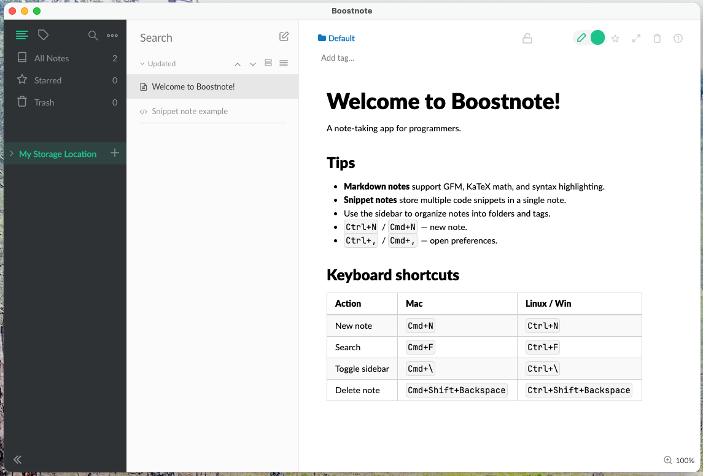

<h1 align="center">BoostNote-Legacy</h1>

<h4 align="center">Note-taking app for programmers.</h4>
<h5 align="center">Apps available for Mac (Intel & Apple Silicon), Windows and Linux.</h5>
<h5 align="center">Built with Electron 11, React + Redux, Webpack 1, and CSSModules.</h5>

<p align="center">
  <a href="https://github.com/ebal/BoostNote-Legacy">
    
  </a>
  <a href="https://github.com/ebal/BoostNote-Legacy/releases">
    
  </a>
</p>

This is the **legacy** branch of Boostnote — a markdown-first, open-source note-taking application for developers. Notes are stored as local files (`.cson`) in user-defined storage directories.

---

## Features

- **Markdown notes** with GFM, KaTeX math, syntax highlighting, diagrams (mermaid, flowchart.js, PlantUML, sequence)
- **Snippet notes** — multi-tab code snippet collections
- **Folder & tag-based organization**
- **Full-text search** across all notes
- **Multiple storage locations**
- **English interface**
- **Full keyboard navigation**
- **Vim/Emacs/Sublime keymaps** for CodeMirror

---



[More screenshots](./screenshots.md)

## Recent updates (v0.17.x)

| Version | What changed |
|---------|-------------|
| 0.17.25 | Force dep versions (sockjs, serve-static, tmp, node-fetch, tough-cookie, moment); bump mermaid 8.14→9.1.7 |
| 0.17.24 | Force cookie dep; bump highlight.js to ^10.4.1 (resolves 9.x EOL) |
| 0.17.23 | Fix CodeQL alerts (inefficient regex, bad HTML filter, sanitization); add screenshots |
| 0.17.22 | Fix CodeQL alerts (ReDoS, sanitization, permissions); force dependency versions via yarn resolutions |
| 0.17.21 | Bump deps (uuid, fsevents, http-proxy); fix passive event listeners; strip sourcemaps |
| 0.17.20 | Fix extension convention for dist artifacts (`.tar.gz` macOS, `.zip` Linux); remove ISSUE_TEMPLATE; update docs |
| 0.17.19 | Patch CodeMirror and react-sortable-hoc touch listeners as passive; cleanup repo and workflow |
| 0.17.18 | New app icon and logo, fix mouse wheel scroll in markdown editor-only mode |
| 0.17.16 | Remove appdmg dead code, strip dead files from git history (23→18 MB), fix prettier |
| 0.17.14 | Remove snap, docs, FAQ, TASKS, non-en locales, VSCode gitignore, stale code_style refs |
| 0.17.13 | Replace broken `.dmg` artifacts with cross-platform `.zip` archives; remove `create-dmgs` CI job |
| 0.17.10 | Cleanup dead config, fix CoffeeScript bug, normalize line endings, fix CI workflow |
| 0.17.9 | Upgrade Docker to node:22, add macOS DMG build workflow, fix Node 22 test compat |
| 0.17.8 | Add layout styles for Preferences modal info and snippet tabs |
| 0.17.7 | Strip hash fragment from file:// URIs in context menu builder |
| 0.17.6 | Guard spawnUpdate null-deref, fix storageNoteMap key / folderNoteSet init, remove spurious backspace events |
| 0.17.5 | Remove dead File > Update menu item and auto-update infrastructure |
| 0.17.4 | Fix Settings modal Escape crash with bound close method, add git tag on version bump |
| 0.17.3 | Fix DevTools CSS source map warnings, add build-test-verify agent skill |
| 0.17.2 | Fix font selection in Settings, fix Settings crash, remove Custom… option |
| 0.17.1 | Prettier lint fix for UiTab.js editor font dropdown |
| 0.17.0 | Removed all non-English interface languages; English-only Settings UI |
| 0.16.9 | Greek (el_GR) spellcheck dictionary, rewritten readme, version-bump agent skill |
| 0.16.8 | Unified Dockerfile for Intel & Apple Silicon |
| 0.16.7 | **Electron 5 → 11.5.0**, native arm64 (Apple Silicon) build, Dialog API migration |
| 0.16.6 | Removed BoostIO marketing integrations, auto-update UI |
| 0.16.5 | **Removed all analytics telemetry** (AWS SDK, tracking calls) |
| 0.16.4 | Removed auto-update, git commit hash in About dialog, zero-lint-warning baseline |
| 0.16.3 | Upgraded all deps to latest compatible; markdown-it 12 fix |
| 0.16.2 | Electron 1.x → 5.0.13, multi-stage Dockerfile |

Full changelog: [CHANGELOG.md](CHANGELOG.md)

---

## Build (Docker only)

All builds run **inside Docker** — never run `npm`/`yarn`/`electron`/`grunt` on the host.

### amd64 (Intel Mac / Linux / Windows)

```bash
docker build --build-arg GIT_COMMIT=$(git rev-parse --short HEAD) -t boostnote-legacy .
```

### arm64 (Apple Silicon Mac)

```bash
docker build --platform linux/arm64 \
  --build-arg GIT_COMMIT=$(git rev-parse --short HEAD) \
  --build-arg BUILDARCH=arm64 \
  -t boostnote-legacy-arm64 .
```

### Export all artifacts

```bash
# Intel
docker cp $(docker create --rm boostnote-legacy):/app/dist/Boostnote-darwin-x64 ./dist/ && docker cp $(docker create --rm boostnote-legacy):/app/dist/Boostnote-darwin-x64.zip ./dist/ && docker cp $(docker create --rm boostnote-legacy):/app/dist/Boostnote-linux-x64.tar.gz ./dist/
# Apple Silicon
docker cp $(docker create --rm boostnote-legacy-arm64):/app/dist/Boostnote-darwin-arm64 ./dist/ && docker cp $(docker create --rm boostnote-legacy-arm64):/app/dist/Boostnote-darwin-arm64.zip ./dist/
```

---

## Development

```bash
docker run --rm boostnote-legacy npm run dev
```

Starts webpack-dev-server on `:8080` with Electron HMR.

---

## Test & Lint

```bash
# All tests
docker run --rm boostnote-legacy npm test

# Lint
docker run --rm boostnote-legacy npm run lint

# AVA only
docker run --rm boostnote-legacy npm run ava

# Jest only
docker run --rm boostnote-legacy npm run jest
```

> **Note:** Jest picks up test files inside `dist/Boostnote-darwin-*/` — pre-existing failures with environment mismatch. `attachmentManagement` test fails with `fs-extra`/`graceful-fs` incompatibility; `normalizeEditorFontFamily` test fails with CSS quoting mismatch. These are unrelated to code changes.

---

## Architecture

```
index.js → Squirrel lifecycle → lib/main-app.js
                                    ├── lib/main-window.js (BrowserWindow)
                                    ├── lib/main-menu.js (native menu)
                                    ├── lib/ipcServer.js (node-ipc)
                                    └── lib/touchbar-menu.js
                                            ↓
browser/main/index.js (webpack entry → compiled/main.js)
    ├── Redux store (browser/main/store.js)
    ├── Main.js → SideNav | NoteList | Detail
    ├── components/ (MarkdownEditor, MarkdownPreview, CodeEditor, etc.)
    └── lib/ (markdown processing, search, i18n, data API)
```

---

## Tech stack

| Layer | Technology |
|-------|-----------|
| Runtime | Electron 11.5.0 (Chrome 87, Node 12) |
| UI | React 16 + React Router 5 |
| State | Redux 4 + Immutable.js (via Mutable.js wrappers) |
| Editor | CodeMirror 5 (GFM mode + custom BFM mode) |
| Markdown | markdown-it 12 (15 plugins) |
| CSS | Stylus + CSS Modules |
| Build | Webpack 1 + Babel 6 + Grunt |
| Packaging | electron-packager 15 |
| Tests | AVA + Jest |

---

## License

[GPL v3](./LICENSE.md)

