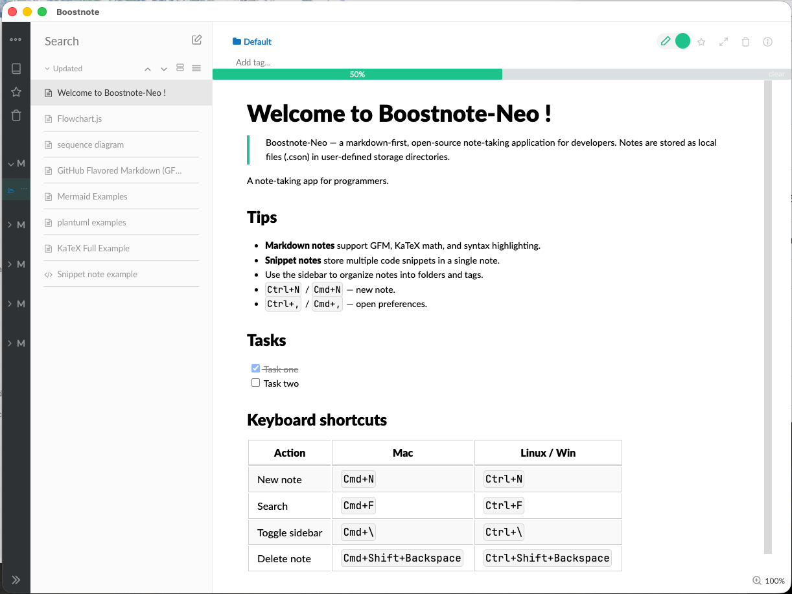

<h1 align="center">BoostNote-Neo</h1>

<h4 align="center">Note-taking app for programmers.</h4>
<h5 align="center">Apps available for Mac (Intel & Apple Silicon), Windows and Linux.</h5>
<h5 align="center">Built with Electron 42, React 18 + Redux, Webpack 5, and CSSModules.</h5>

<p align="center">
  <a href="https://github.com/A93162639/BoostNote-Neo">
    
  </a>
  <a href="https://github.com/A93162639/BoostNote-Neo/releases">
    
  </a>
</p>

BoostNote-Neo is a modernized fork of Boostnote Legacy — a markdown-first, open-source note-taking application for developers. Notes are stored as local files (`.cson`) in user-defined storage directories.

---

## Features

- **Markdown notes** with GFM, KaTeX math, syntax highlighting, diagrams (mermaid, flowchart.js, PlantUML, sequence)
- **Snippet notes** — multi-tab code snippet collections
- **Folder & tag-based organization**
- **Full-text search** across all notes
- **Multiple storage locations**
- **English interface**
- **Full keyboard navigation**
- **Vim/Emacs/Sublime keymaps** for CodeMirror

---



[More Screenshots](./Screenshots.md)

## Recent updates

| Version | What changed |
|---------|-------------|
| 0.20.3 | Dockerfile cleanup (drop fakeroot, fix node:20 comment drift); refresh dep-resolve + version-bump skills; add React 19 unblock recipe to bisect plan |
| 0.20.2 | Patch semver + markdown-it ReDoS alerts; bundle redux + react-redux (drop UMD externals); KaTeX mhchem + auto-render extensions; bridge renderer clipboard through ipcMain |
| 0.20.1 | Fix babel ES5 target chain; fix css-loader 6 export shape; fix mermaid 10 import() publicPath; fix Chrome console noise (Violation + font-display); fix Electron 42 vm filter; patch ajv #47; drop stale resolutions + devDeps; inline DevTools stub; clean up plans |
| 0.20.0 | **Webpack 1.15.0 → 5.107.2** (7 phases) + **Babel 6 → 7** + acorn 5→8 + post-acorn deps (uuid 9→11, mermaid 9→10, highlight.js 10→11); rewrote `MermaidRender.js` for v10 Promise API; CSS Modules under css-loader 6 schema; dev script rewritten for wds 5 — clears all 15 open Dependabot alerts |
| 0.19.0 | **Electron 14.2.9 → 42.3.0** (4 phases, Chromium 87→138, Node 12→22, V8 9.3→13.x, clears 22+ CVE alerts); **Jest 22→27** + Babel 7 alongside 6; turndown 4→7; clean up plans + dead code; revert js-yaml 4→3 (lint regression) |
| 0.18.3 | Upgrade js-yaml 3→4 (-290KB bundle); 7 CVE-forced resolutions (dompurify 3.x, tmpl, lodash.template, path-to-regexp, @babel/runtime, merge, d3-color); upgrade cross-env 7→10, iconv-lite 0.4→0.7, file-uri-to-path 1→2 |
| 0.18.2 | **React 17.0.2 → 18.3.1** (createRoot); 6 UNSAFE_* → safe lifecycles; migrate 14 AVA tests→Jest; upgrade 11 deps (react-redux, react-autosuggest, react-transition-group, sander, markdown-it-footnote, mdurl, electron-config, markdown-it-multimd-table, copy-to-clipboard, striptags); suppress vm deprecation; drop AVA + 14 orphaned tests |
| 0.18.1 | **React 16.14.0 → 17.0.2**; `electron-packager` 15→17; bump 4 in-major patches; drop unused deps; 3 deferred Electron 14 follow-ups (menu.popup, printToPDF, nativeWindowOpen) |
| 0.18.0 | **Electron 11.5.0 → 14.2.9** (Chromium 87 → 93, Node 12 → 14.17); migrate `electron.remote` → `@electron/remote@^2.1.3` across 23 renderer files; bump 13 in-major dep patches/minors (Tier 1–4); force `minimatch ^3.1.4` (CVE-2022-3517) |
| 0.17.31 | Add GitHub-style alert blockquotes; fix <details> collapse, naughtyIFrame, alert CSS; drop sanitize-html |
| 0.17.30 | Add PlantUML SVG render, ```flow alias; fix plantuml HTML entities, mermaid NaN guard, sanitizeInline regex, raphael pin, Dockerfile patch |
| 0.17.29 | Bump katex to ^0.16.47; bulk upgrade 14 deps; force deps (dompurify, handlebars, follow-redirects, codemirror, kind-of, form-data, eventsource, decompress-zip, ajv, remarkable, lodash.merge, acorn); fix regressions |
| 0.17.28 | Add dep-resolve skill; force deps (decode-uri-component, ws, got, glob-parent, js-yaml, set-value, ansi-regex) |
| 0.17.27 | Bump sanitize-html to ^2.7.1; force dep versions (url-parse, dot-prop, async, ua-parser-js, sha.js, underscore, express, on-headers, min-document); drop unused immutable |
| 0.17.26 | Drop dead deps (devtron, redux-devtools, standard, concurrently, react-input-autosize, deb/rpm scaffold); force brace-expansion |
| 0.17.25 | Force dep versions (sockjs, serve-static, tmp, node-fetch, tough-cookie, moment); bump mermaid 8.14→9.1.7 |
| 0.17.24 | Force cookie dep; bump highlight.js to ^10.4.1 (resolves 9.x EOL) |
| 0.17.23 | Fix CodeQL alerts (inefficient regex, bad HTML filter, sanitization); add screenshots |
| 0.17.22 | Fix CodeQL alerts (ReDoS, sanitization, permissions); force dependency versions via yarn resolutions |
| 0.17.21 | Bump deps (uuid, fsevents, http-proxy); fix passive event listeners; strip sourcemaps |
| 0.17.20 | Fix extension convention for dist artifacts (`.tar.gz` macOS, `.zip` Linux); remove ISSUE_TEMPLATE; update docs |
| 0.17.19 | Patch CodeMirror and react-sortable-hoc touch listeners as passive; cleanup repo and workflow |
| 0.17.18 | New app icon and logo, fix mouse wheel scroll in markdown editor-only mode |
| 0.17.16 | Remove appdmg dead code, strip dead files from git history (23→18 MB), fix prettier |
| 0.17.14 | Remove snap, docs, FAQ, TASKS, non-en locales, VSCode gitignore, stale code_style refs |
| 0.17.13 | Replace broken `.dmg` artifacts with cross-platform `.zip` archives; remove `create-dmgs` CI job |
| 0.17.10 | Cleanup dead config, fix CoffeeScript bug, normalize line endings, fix CI workflow |
| 0.17.9 | Upgrade Docker to node:22, add macOS DMG build workflow, fix Node 22 test compat |
| 0.17.8 | Add layout styles for Preferences modal info and snippet tabs |
| 0.17.7 | Strip hash fragment from file:// URIs in context menu builder |
| 0.17.6 | Guard spawnUpdate null-deref, fix storageNoteMap key / folderNoteSet init, remove spurious backspace events |
| 0.17.5 | Remove dead File > Update menu item and auto-update infrastructure |
| 0.17.4 | Fix Settings modal Escape crash with bound close method, add git tag on version bump |
| 0.17.3 | Fix DevTools CSS source map warnings, add build-test-verify agent skill |
| 0.17.2 | Fix font selection in Settings, fix Settings crash, remove Custom… option |
| 0.17.1 | Prettier lint fix for UiTab.js editor font dropdown |
| 0.17.0 | Removed all non-English interface languages; English-only Settings UI |
| 0.16.9 | Greek (el_GR) spellcheck dictionary, rewritten readme, version-bump agent skill |
| 0.16.8 | Unified Dockerfile for Intel & Apple Silicon |
| 0.16.7 | **Electron 5 → 11.5.0**, native arm64 (Apple Silicon) build, Dialog API migration |
| 0.16.6 | Removed BoostIO marketing integrations, auto-update UI |
| 0.16.5 | **Removed all analytics telemetry** (AWS SDK, tracking calls) |
| 0.16.4 | Removed auto-update, git commit hash in About dialog, zero-lint-warning baseline |
| 0.16.3 | Upgraded all deps to latest compatible; markdown-it 12 fix |
| 0.16.2 | Electron 1.x → 5.0.13, multi-stage Dockerfile |

Full changelog: [CHANGELOG.md](CHANGELOG.md)

---

## Build (Docker only)

All builds run **inside Docker** — never run `npm`/`yarn`/`electron`/`grunt` on the host.

### amd64 (Intel Mac / Linux / Windows)

```bash
docker build --build-arg GIT_COMMIT=$(git rev-parse --short HEAD) -t boostnote-neo .
```

### arm64 (Apple Silicon Mac)

```bash
docker build --platform linux/arm64 \
  --build-arg GIT_COMMIT=$(git rev-parse --short HEAD) \
  --build-arg BUILDARCH=arm64 \
  -t boostnote-neo-arm64 .
```

### Export all artifacts

```bash
# Intel
docker cp $(docker create --rm boostnote-neo):/app/dist/Boostnote-darwin-x64 ./dist/ && docker cp $(docker create --rm boostnote-neo):/app/dist/Boostnote-darwin-x64.zip ./dist/ && docker cp $(docker create --rm boostnote-neo):/app/dist/Boostnote-linux-x64.tar.gz ./dist/
# Apple Silicon
docker cp $(docker create --rm boostnote-neo-arm64):/app/dist/Boostnote-darwin-arm64 ./dist/ && docker cp $(docker create --rm boostnote-neo-arm64):/app/dist/Boostnote-darwin-arm64.zip ./dist/
```

---

## Development

```bash
docker run --rm boostnote-neo npm run dev
```

Starts webpack-dev-server on `:8080` with Electron HMR.

---

## Test & Lint

```bash
# All tests
docker run --rm boostnote-neo npm test

# Lint
docker run --rm boostnote-neo npm run lint

# Jest only (alias)
docker run --rm boostnote-neo npm run jest
```

> **Note:** Jest picks up test files inside `dist/Boostnote-darwin-*/` — pre-existing failures with environment mismatch. `attachmentManagement` test fails with `fs-extra`/`graceful-fs` incompatibility; `normalizeEditorFontFamily` test fails with CSS quoting mismatch. These are unrelated to code changes.

---

## Architecture

```
index.js → Squirrel lifecycle → lib/main-app.js
                                    ├── lib/main-window.js (BrowserWindow)
                                    ├── lib/main-menu.js (native menu)
                                    ├── lib/ipcServer.js (node-ipc)
                                    └── lib/touchbar-menu.js
                                            ↓
browser/main/index.js (webpack entry → compiled/main.js)
    ├── Redux store (browser/main/store.js)
    ├── Main.js → SideNav | NoteList | Detail
    ├── components/ (MarkdownEditor, MarkdownPreview, CodeEditor, etc.)
    └── lib/ (markdown processing, search, i18n, data API)
```

---

## Tech stack

| Layer | Technology |
|-------|-----------|
| Runtime | Electron 42.3.0 (Chromium 138, Node 22, V8 13.x) |
| UI | React 18.3.1 + React Router 5 |
| State | Redux 5.0.1 + react-redux 9.2.0 + Immutable.js (via Mutable.js wrappers) |
| Editor | CodeMirror 5.65 (GFM mode + custom BFM mode) |
| Markdown | markdown-it 14.1.1 (15 plugins) |
| CSS | Stylus + CSS Modules |
| Build | Webpack 5.90 + Babel 7 + Grunt |
| Packaging | electron-packager 17.1.2 |
| Tests | Jest 27 |

---

## License

[GPL v3](./LICENSE.md)

