# Screenshots

Boostnote-Neo screenshots of supported formats:

* GFM
* KaTeX math
* Code Syntax highlighting
* Diagrams:
	* mermaid
	* flowchart.js
	* PlantUML
	* sequence diagrams

## The About dialog showing the current version and build information.

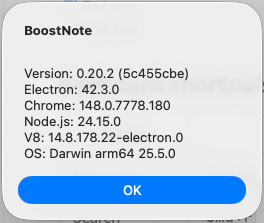

## A snippet note with multiple code tabs open side by side.

## A markdown note with rich preview and syntax highlighting.

## The editor toggle feature switching between split and single-pane views.

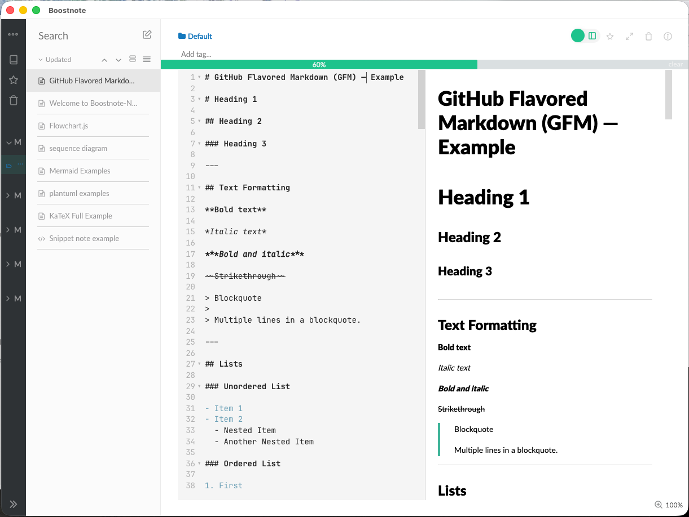

## A markdown note rendering Mermaid flowchart diagrams.

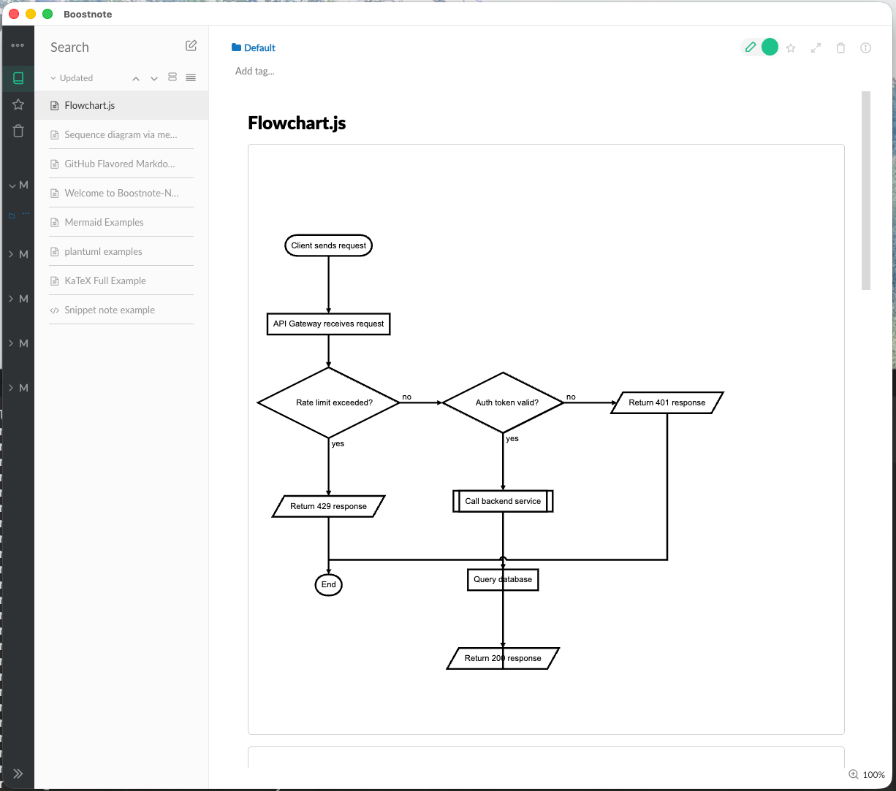

## A markdown note rendering Mermaid sequence diagrams.

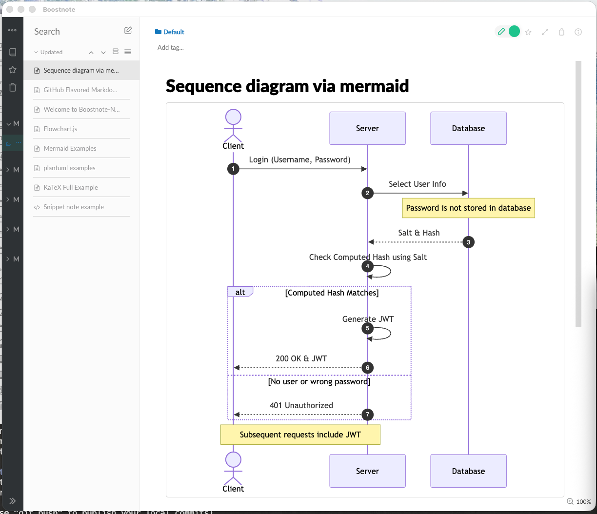

## A markdown note rendering PlantUML diagrams.

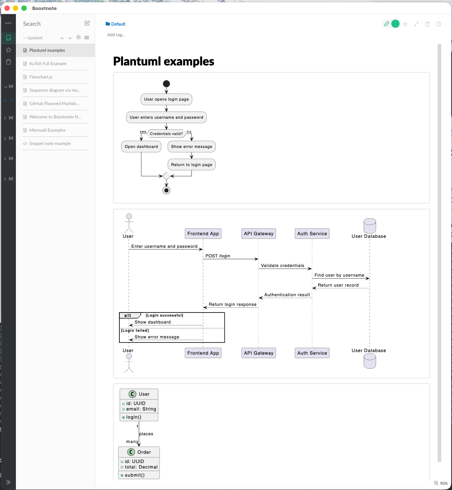

## A markdown note rendering KaTeX mathematical expressions.

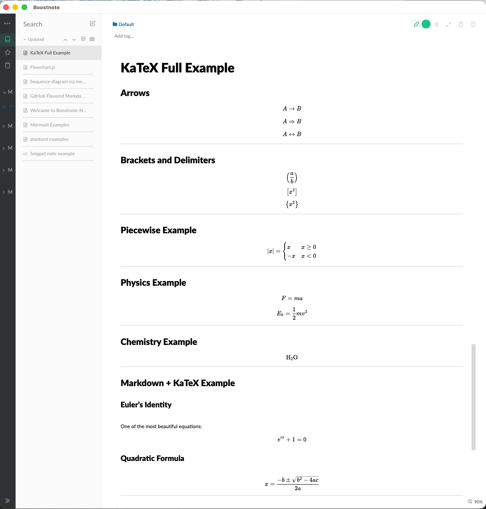

## Mermaid diagram example 1.

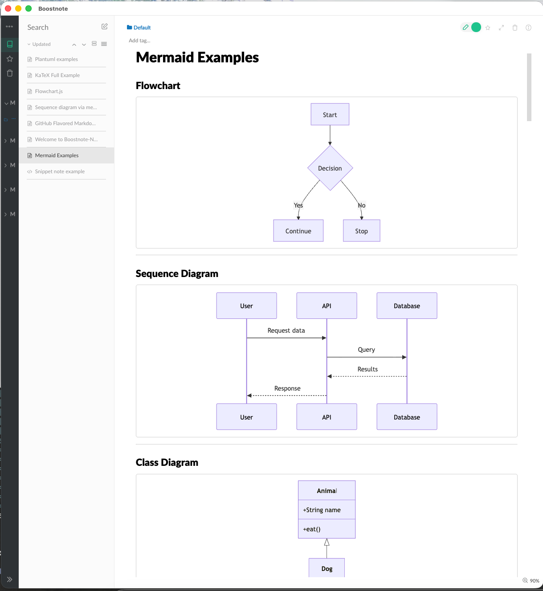

## Mermaid diagram example 2.

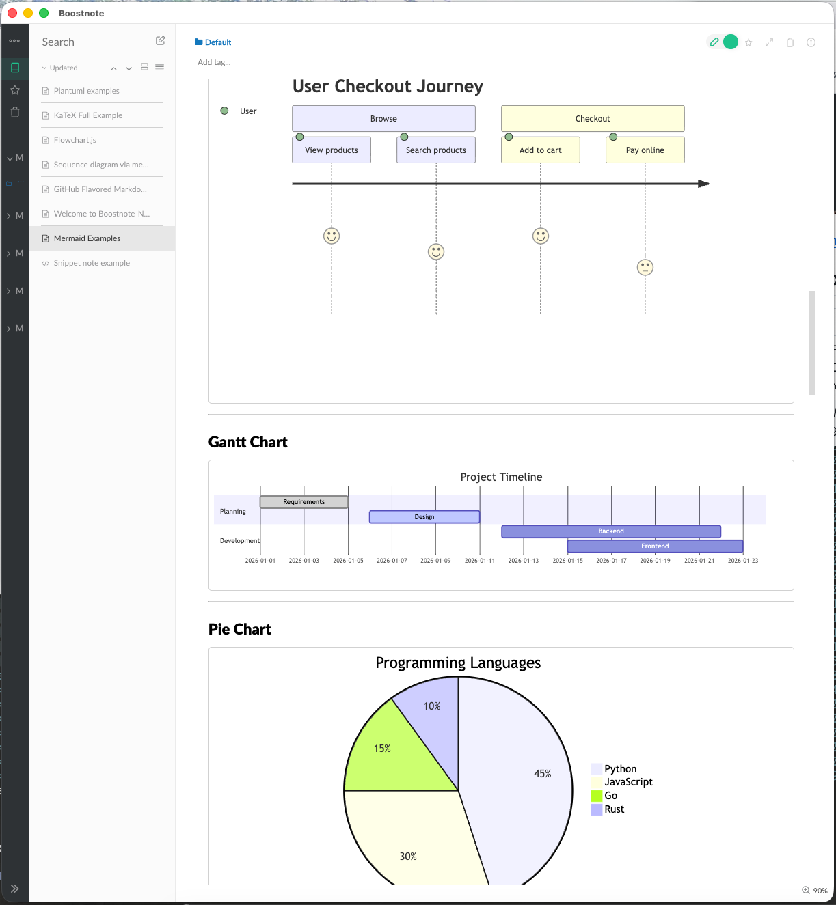

## Mermaid diagram example 3.

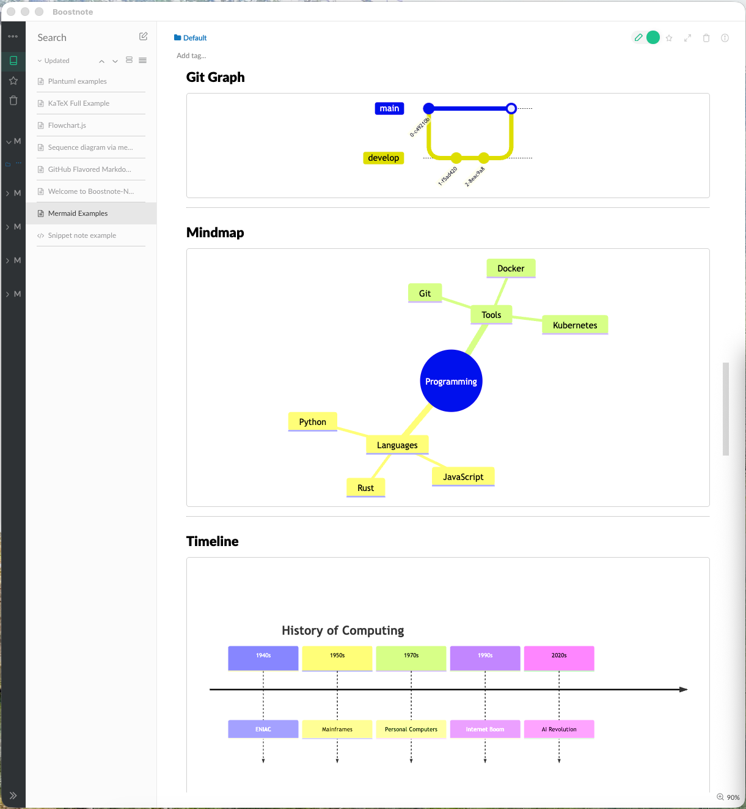

## Mermaid diagram example 4.

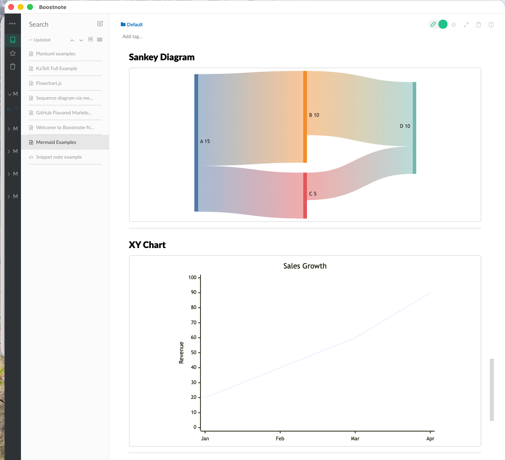

## Mermaid diagram example 5.

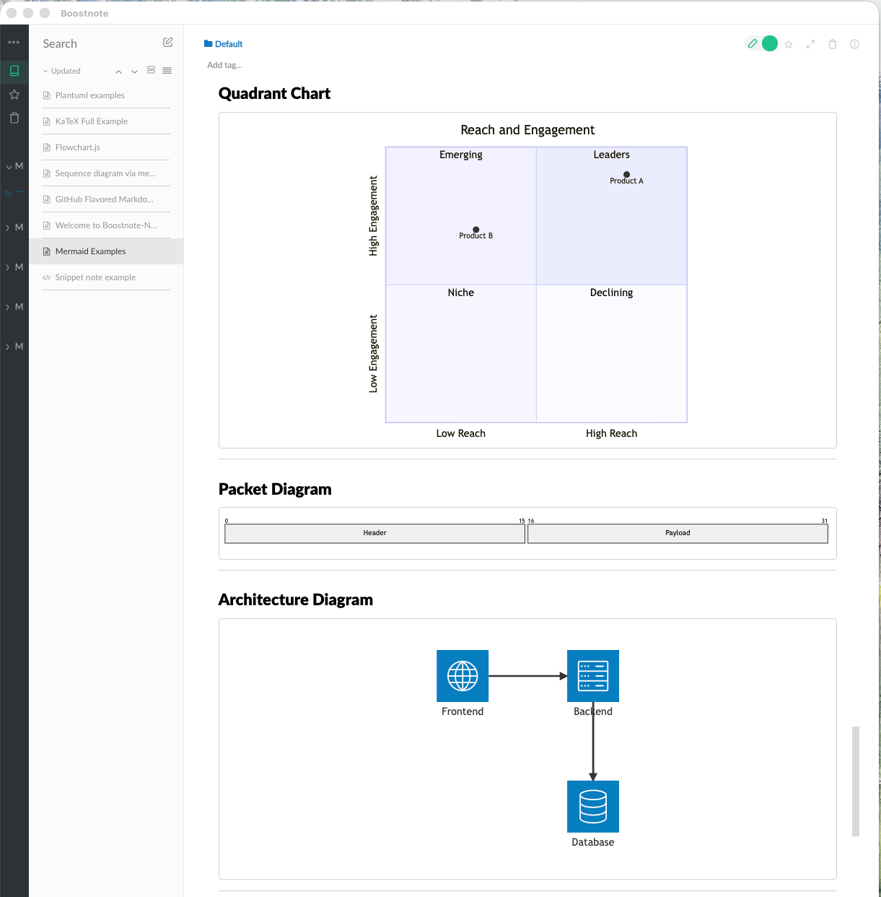

## Mermaid diagram example 6.

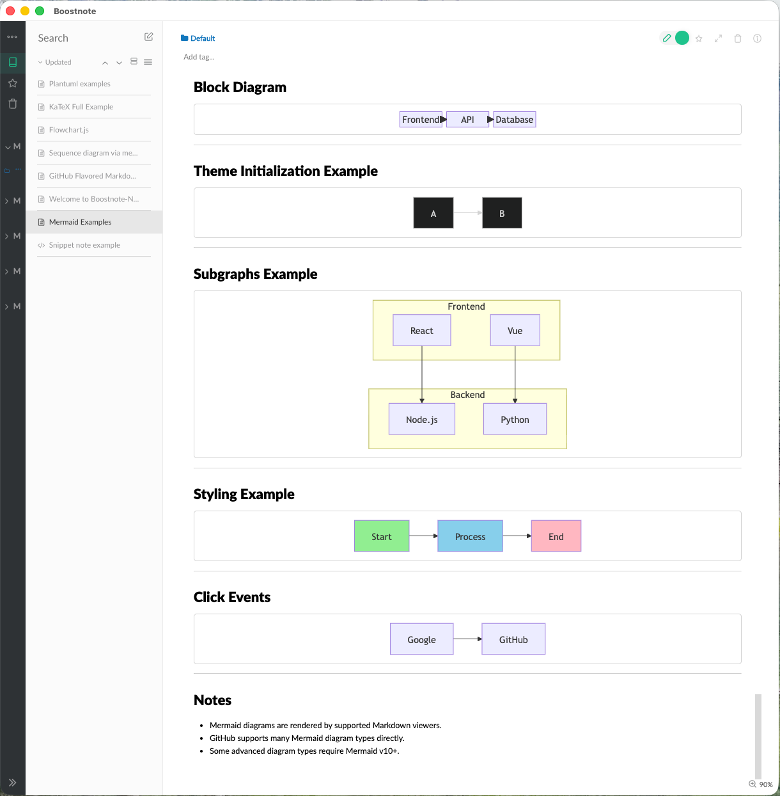

