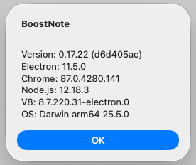
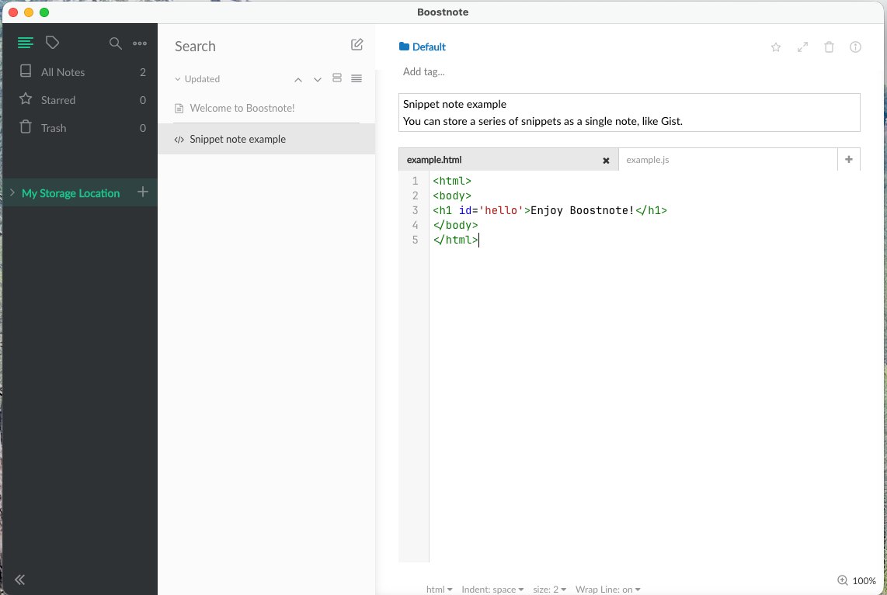
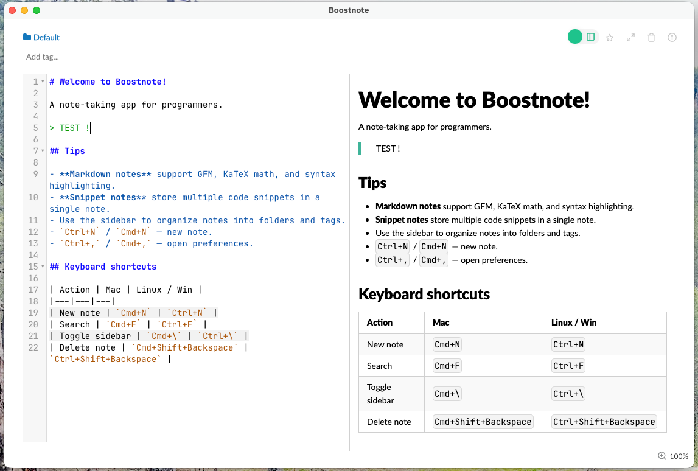

# Screenshots

The About dialog showing the current version and build information.

A snippet note with multiple code tabs open side by side.

A markdown note with rich preview and syntax highlighting.

The editor toggle feature switching between split and single-pane views.
